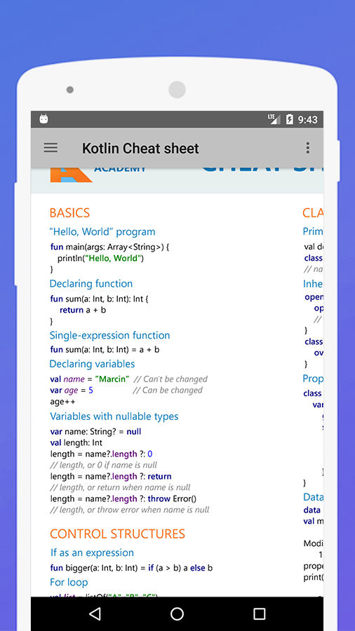
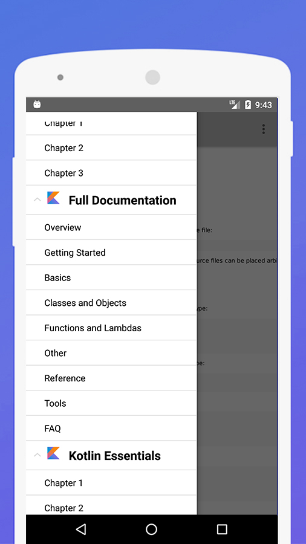
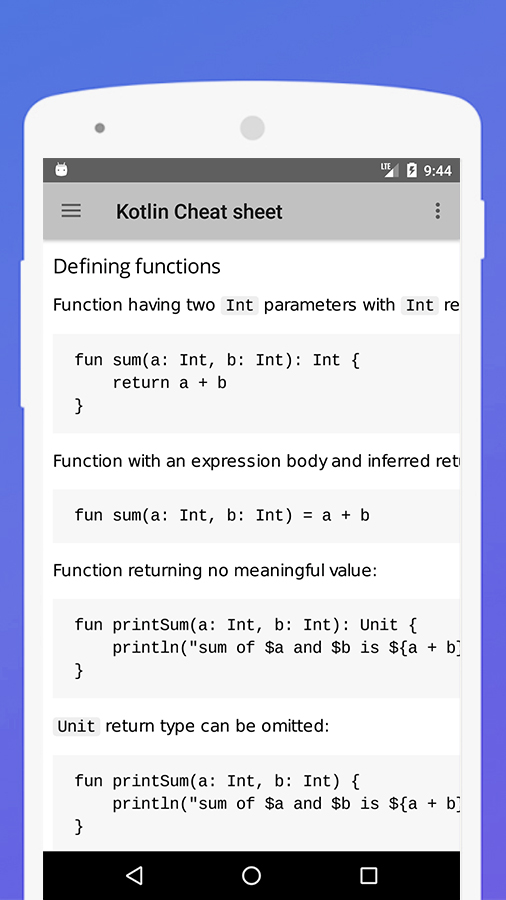
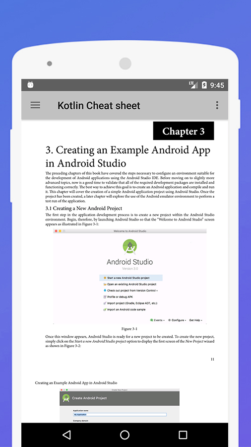
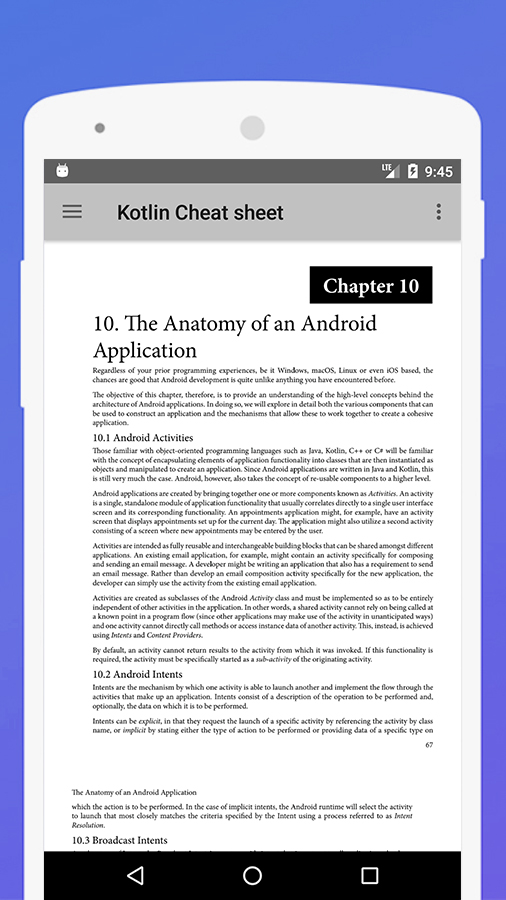
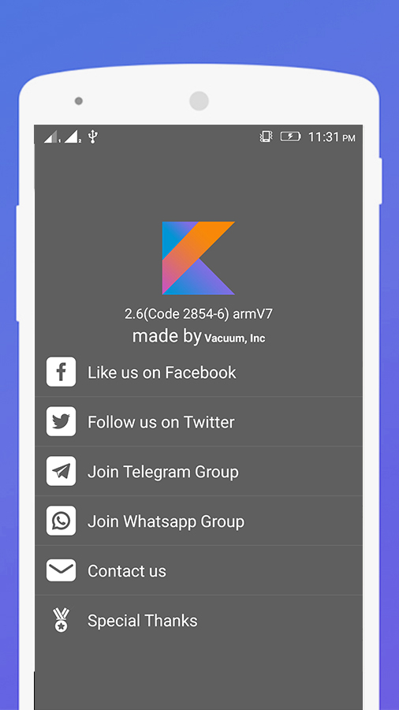

KotlinCheatsheet-app
==================


[](https://www.codacy.com/app/maksim-m/Popular-Movies-App) [](https://travis-ci.org/maksim-m/Popular-Movies-App) [](https://www.codacy.com/app/piyushguptaece/hypertrack-live-android?utm_source=github.com&utm_medium=referral&utm_content=hypertrack/hypertrack-live-android&utm_campaign=badger) [](http://slack.hypertrack.com) [](https://android-arsenal.com/details/3/5754) [](https://opensource.org/licenses/MIT) [](https://opensource.org/licenses/MIT)  


You can have the most important elements close at hand — it is the best everyday support for Kotlin developer. Kotlin is a new programming language created by JetBrains and targeting the JVM, Android and the browser. Kotlin is concise, safe, and fully interoperable with existing Java and JavaScript code. Kotlin helps avoid common errors such as NPEs and strives to make programming more pleasant.  At the Google I/O conference, Google has announced official support for Kotlin as a language for developing Android applications, meaning that Kotlin development tools are now bundled with Android Studio.  This cheat sheet will introduce you to the most important elements of the Kotlin syntax. To learn more, visit the Kotlin web site here.

<a href="https://itunes.apple.com/us/app/whos-in-space/id916499517">

</a>  <a href="https://play.google.com/store/apps/details?id=com.vacuum.kotlincheatsheet">

</a>

======================================


**Features:**

Google Play Release V2.6:
- KotlinCheatSheet 
- kotlin full documentation
- Kotlin Essentials
- Programming Kotlin
- Fix Bugs
- About Us
- Discover Kotlin Methods
- Read reviews about kotlin
- Offline work
- Material design
- UI optimized for phone and tablet

**Download:**

You can download APK [on releases page][5].

Screenshots
-----------

     

Developer setup
---------------

### Requirements

- Java 8
- Latest version of Android SDK and Android Build Tools

How to Contribute
=======

We welcome your contributions to this project. There are various ways to contribute:

**Reporting issues**

Help improve the project by reporting issues that you find by filing a new issue here in this repository

**Features suggestions**

You can also add feature suggestions by filing a new issue here

**Documentation**

You can help by adding or improving existing documentation. Simply send us a pull request for us to consider your proposed changes.

**Bug fixes**

Pull requests are welcome for minor bug fixes that do not involve any changes to existing API. These changes should ideally be accompanied by a test case that would have otherwise failed without the fix.

**New API or API changes**

Pull requests for new APIs or changes to existing APIs are welcome, but may require a bit of
discussion. Consider creating an issue to discuss any changes before you implement the change.

Before submitting
=======

* Check that lint, unit tests, and code style enforcement all pass by running `./gradlew check`. Use Lint to check the warning and errors you code can have, clean code is a happy code, Android studio counts with a Lint processor and analyzer, so please refer yourself to this link: (https://developer.android.com/studio/write/lint.html)
* Check that instrumentation tests pass by starting an API 26 or newer emulator and running
`./gradlew connectedCheck` 
* Make comments in every function that you are implementing
```
/**
* Created by Mohamedebrahim96 on 11/29/18.
* My Application, main activity to launch application
*/

@Module
class MyApplication : Application {

private var mApplication: Application? = null
/**
* Companion Object with static objects
*/
companion object {
var mAppComponent: AppComponent? = null
}
}
```

* Every method that was implemented in the Presentation Layer, must be tested, at least the Presenter of every Activity and every Fragment, if they dont have it, the pull will be rejected.
* Every method must be clean and sharpe, we don't need any boilerplate, so please make code readable


Handle of this project
=======

In order to use this project, please follow the next steps:

1. If you are using Android 3.0 or later, the project will be inserting by all ends the necesary plugins for Koltin
2. If not, you will require using the plugin of JetBrains, to solve Kotlin, you can found it inside Preferences -> Plugins and select Kotlin plugin
3. Then, you can simple import this project and you are ready to go

### Building

You can build the app with Android Studio or with `./gradlew assembleDebug` command.

### Testing

This project integrates a combination of [local unit tests][2], [instrumented tests][3] and [code analysis tools][4].

Just run `build.sh` to ensure that project code is valid and stable.
This will run local unit tests on the JVM, instrumented tests on connected device (or emulator) and analyse code with Checkstyle, Findbugs and PMD.


License
-------

    Copyright 2018 Vacuum,Inc

    Licensed under the Apache License, Version 2.0 (the "License");
    you may not use this file except in compliance with the License.
    You may obtain a copy of the License at

       http://www.apache.org/licenses/LICENSE-2.0

    Unless required by applicable law or agreed to in writing, software
    distributed under the License is distributed on an "AS IS" BASIS,
    WITHOUT WARRANTIES OR CONDITIONS OF ANY KIND, either express or implied.
    See the License for the specific language governing permissions and
    limitations under the License.

[1]: https://www.themoviedb.org/documentation/api
[2]: app/src/test/
[3]: app/src/androidTest/
[4]: quality/
[5]: https://play.google.com/store/apps/details?id=com.vacuum.kotlincheatsheet

